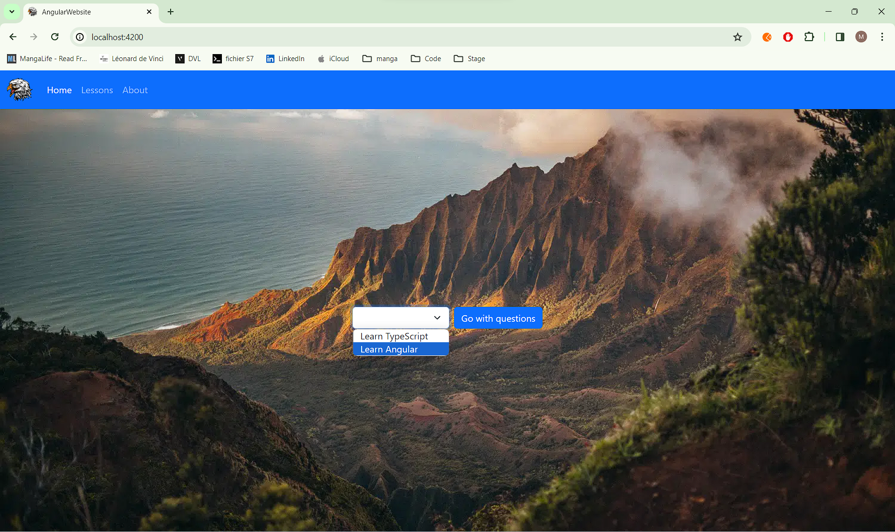
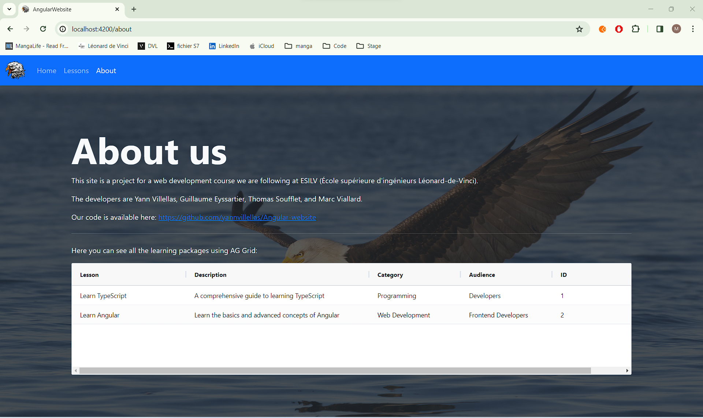
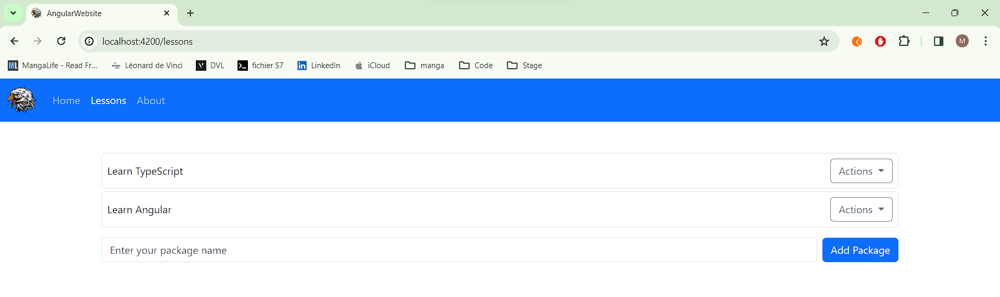
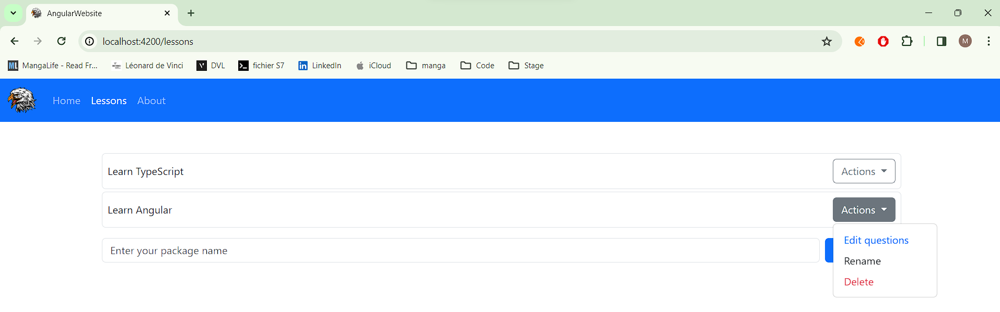
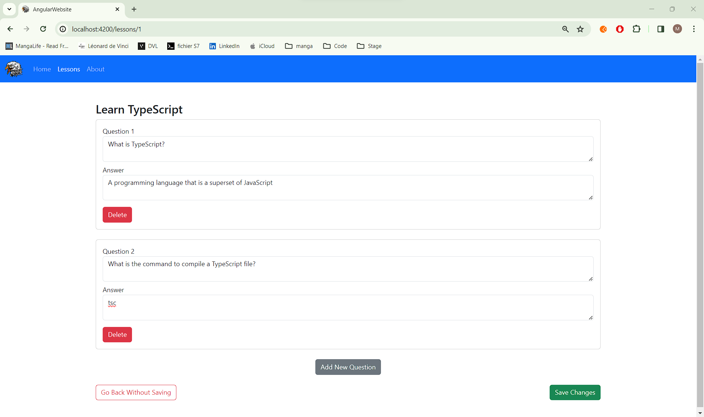
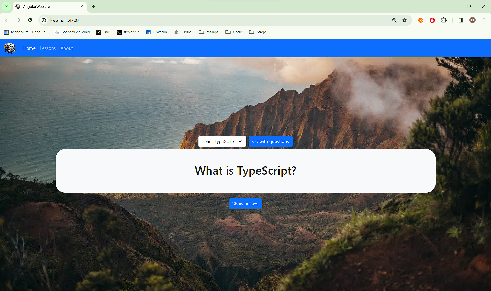
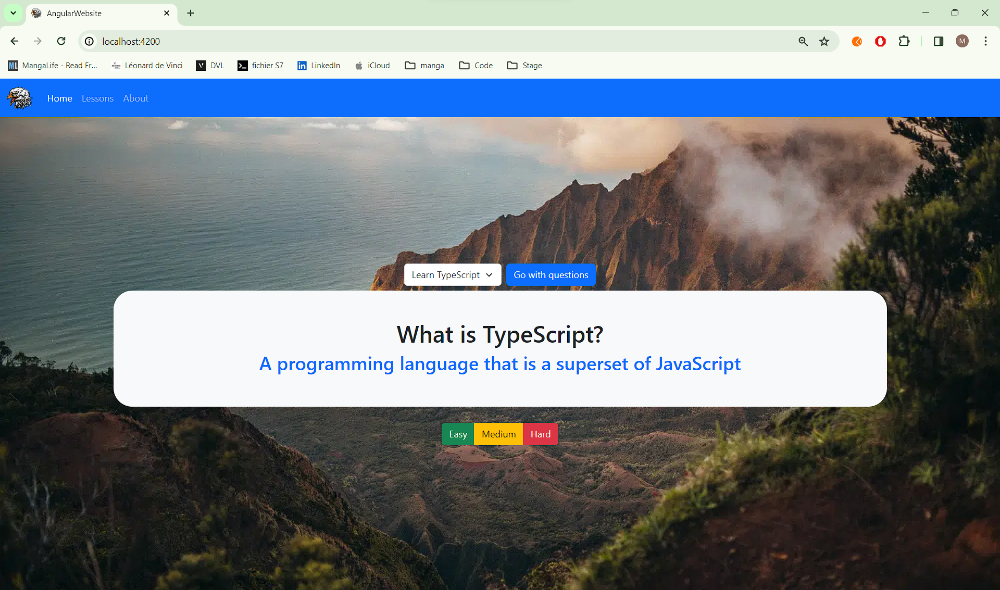

# Project

This site is a project for a web development course we are following at ESILV (École supérieure d'ingénieurs Léonard-de-Vinci).
It is inspired by anki: https://apps.ankiweb.net/

## Home Page

This is the home page of our site. From this page you can access multiple pages, on the bottom left, you can click on the Home, Lessons or About buttons.
In the middle you can directly access a course using the dropdown list and clicking the button "Go with questions".
## About Page

The purpose of this page is to credit us. You can also see all the learning packages you have, to show this we used the AG Grid technology.

## Lessons Page

On the lesson page you can access all your packages, and even create new ones.

You can even edit questions, rename packages and delete them.

## Edit Questions Page

When you want to edit questions in a package, you have this page. There you can edit the question as well as the expected answer.
You can also add questions. When your finished you can save you changes or discard them.

## Running questions

On the home page, when you click "Go with questions", you'll launch a quizz. It'll start running questions in order, when you think you've got the answer you can click the "show answer" button.

the answer will appear and you will be asked the difficulty of the question, when you click a difficulty level, it will show the next question and so on until you finish the quizz.
